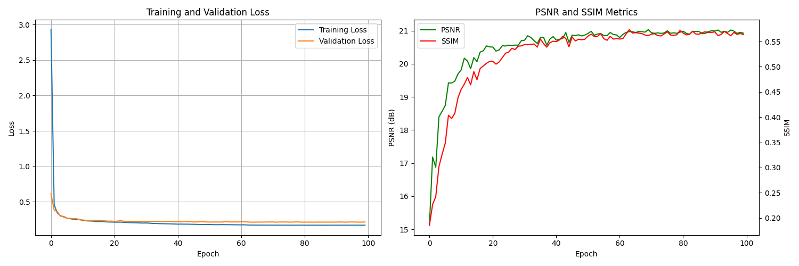
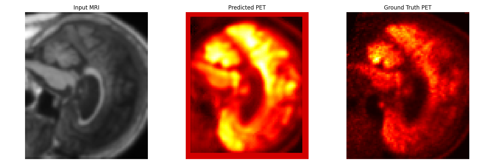

# 3d-U-Net
Implementation of 3d U-Net architecture for mri to pet cross modal synthesis task in Pytorch.

First create a new virtual environment and install all the dependencies. 

Make sure that you update the file path in which you have stored your dataset, I am using ADNI dataset. 
The naming of the files should be in the following manner:
* MRI images should have MPRAGE in the end.
* PET images should have PET_FDG_Coreg_Ave in the end.
* The code will match the mri and pet images on the basis of subject number and the date on which the scan was took.

  Then in the terminal run "python train.py".

  ## Graphs
  

  ## Qualitative Results
  
